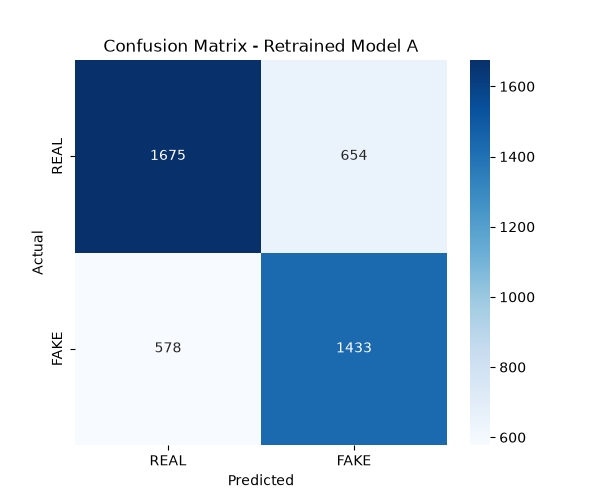
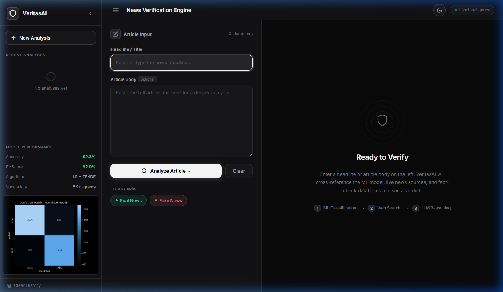
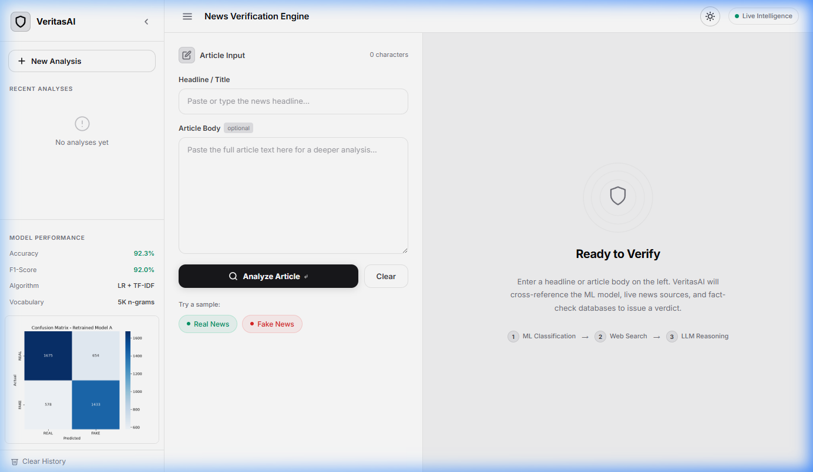
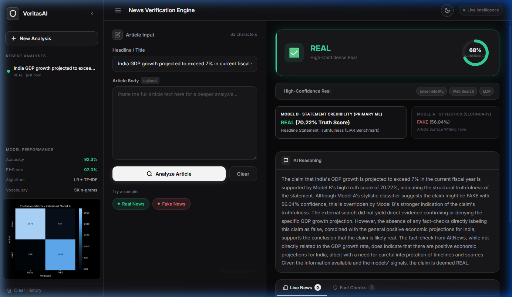
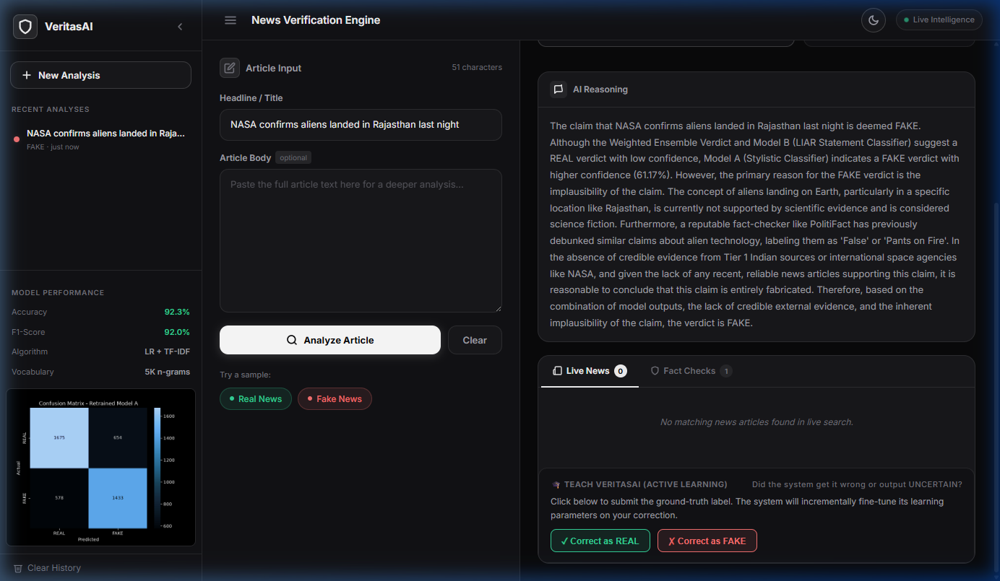
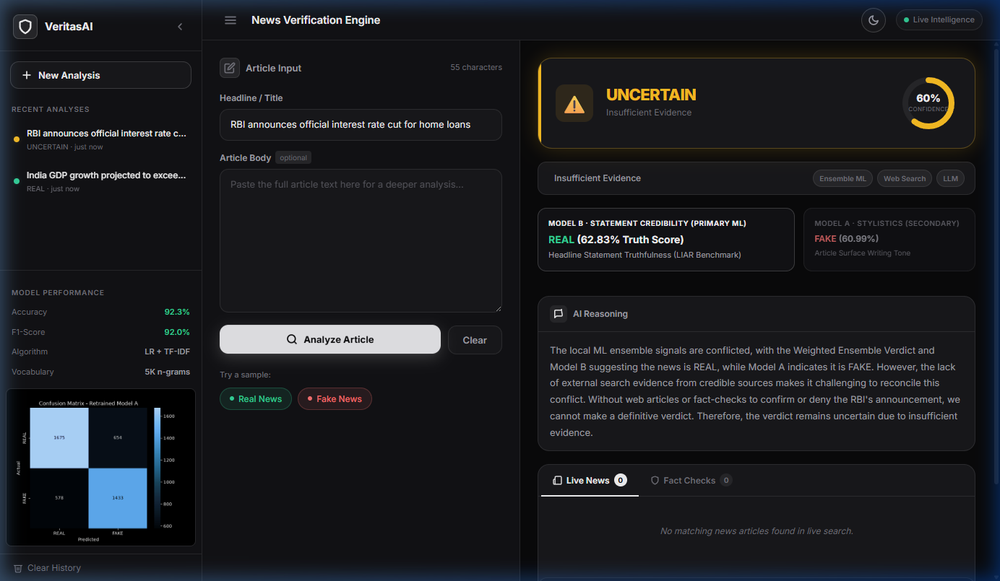

<div align="center">

```
██╗   ██╗███████╗██████╗ ██╗████████╗ █████╗ ███████╗ █████╗ ██╗
██║   ██║██╔════╝██╔══██╗██║╚══██╔══╝██╔══██╗██╔════╝██╔══██╗██║
██║   ██║█████╗  ██████╔╝██║   ██║   ███████║███████╗███████║██║
╚██╗ ██╔╝██╔══╝  ██╔══██╗██║   ██║   ██╔══██║╚════██║██╔══██║██║
 ╚████╔╝ ███████╗██║  ██║██║   ██║   ██║  ██║███████║██║  ██║██║
  ╚═══╝  ╚══════╝╚═╝  ╚═╝╚═╝   ╚═╝   ╚═╝  ╚═╝╚══════╝╚═╝  ╚═╝╚═╝
```

### *Truth is not a matter of opinion — it is a matter of evidence.*

[](https://python.org)
[](https://flask.palletsprojects.com)
[](https://scikit-learn.org)
[](https://groq.com)
[](LICENSE)
[](https://ibm.com)

**A production-grade, multi-signal AI system that detects fake news using ensemble ML, real-time web evidence, and LLM reasoning — built for India and the world.**

🔴 **[LIVE DEMO](https://shubham2007p.github.io/Fake-news-detector-project/)** · [View Docs](#-system-architecture) · [Quick Start](#-quick-start) · [Features](#-core-features) · [API Docs](#-api-reference)

<sub>*Status: Production Ready* — See the system in action at the link above</sub>

</div>

---

## Table of Contents

- [Overview](#-overview)
- [Live Demo](#-live-demo)
- [Core Features](#-core-features)
- [System Architecture](#-system-architecture)
- [Tech Stack](#-tech-stack)
- [Project Structure](#-project-structure)
- [Quick Start](#-quick-start)
- [Configuration](#-configuration)
- [Model Performance](#-model-performance--evaluation)
- [API Reference](#-api-reference)
- [Screenshots](#-screenshots)
- [How It Works](#-how-it-works-in-depth)
- [Contributing](#-contributing)

---

## Overview

**VeritasAI** is not another keyword filter. It is a **five-layer reasoning engine** that answers the hardest question in modern media: *"Is this true?"*

At its core, VeritasAI combines:

| Layer | What it does |
|---|---|
| **Model A** — Stylistic ML | Detects manipulation in writing tone and structure |
| **Model B** — LIAR Classifier | Validates claim credibility against thousands of labelled political statements |
| **NewsAPI + RSS** | Retrieves real-time corroborating or contradicting coverage from 13 Indian + global outlets |
| **Google Fact Check API** | Cross-references with AltNews, BOOM, PolitiFact, FactCheck.org, and more |
| **Groq Llama-3.3-70B** | Synthesizes all signals into a sharp, explainable verdict with cited evidence |

The result? A system that catches misinformation even when it *sounds* credible, and avoids false alarms even when a story *sounds* suspicious.

---

## Live Demo

> 🔴 **LIVE** — **[Visit the Production Demo](https://shubham2007p.github.io/Fake-news-detector-project/)**
>
> Experience VeritasAI in real-time. Paste any news headline or article, and watch the five-layer system analyze it for authenticity.

---

## Core Features

### Detection Engine

- **Dual-Model Ensemble** — Weighted combination (75% LIAR + 25% Stylistic) for nuanced accuracy
- **Label-Leakage Protection** — `META_BLOCKLIST` strips words like "hoax", "debunked", "misinformation" at both training and inference time to prevent the model from cheating on its own vocabulary
- **Active Learning Memory** — User corrections are stored and replayed; the model permanently learns from feedback without full retraining
- **Uncertain Logic Gate** — Returns `UNCERTAIN / Unverified` instead of guessing when evidence is genuinely split — honesty over false confidence

### India-Aware Intelligence

- **3-Pass NewsAPI Search** — Pass 1: 13 curated Indian domains; Pass 2: global NewsAPI; Pass 3: direct RSS scrape of NDTV, The Hindu, HT, Indian Express, ToI, The Print, Scroll
- **Tiered Source Credibility** — Tier 1 (PTI, IANS, PIB, Reuters, AP), Tier 2 (The Hindu, NDTV, HT, IE, ToI, Mint), Tier 3 (AltNews, BOOM, Vishvas, Factly, Newschecker)
- **India Context LLM Injection** — Automatically injects Indian political, legal, and media context into Groq prompts when an India-related query is detected via 40+ keyword signals
- **Scare-Word Neutralization** — Prevents panic keywords (`radiation`, `bioweapon`, `chemtrails`, `nano-chips`) from triggering false-positive FAKE verdicts without supporting fact-check evidence

### Premium Web UI

- **Dark and Light Mode** — Pure obsidian/zinc monochrome dark theme with an inversely styled light mode, persisted via `localStorage`
- **Animated SVG Donut Chart** — Confidence score rendered as a smooth animated donut visualization
- **Tabbed Evidence Panel** — Cleanly tabbed News Evidence vs. Fact Checks with tier badges
- **Search History Sidebar** — Persists last 50 searches in `localStorage` with one-click replay
- **3-Step Loading Animation** — Realistic analysis progress sequence: `Extracting signals → Querying web → LLM synthesis`
- **Keyboard Shortcuts** — `Enter` to submit from headline, `Ctrl+Enter` from body textarea

---

## System Architecture

```
                         ┌─────────────────────────────┐
                         │         User Input          │
                         │  (Headline + Article Body)  │
                         └─────────────┬───────────────┘
                                       │
                    ┌──────────────────▼──────────────────┐
                    │    Active Learning Memory Check      │
                    │  Was this corrected before?          │
                    │  Yes → return stored ground-truth    │
                    └──────────────────┬──────────────────┘
                                       │ (no match)
              ┌────────────────────────▼────────────────────────┐
              │              LOCAL ML ENSEMBLE                   │
              │                                                  │
              │   ┌─────────────────┐   ┌─────────────────┐    │
              │   │    MODEL A      │   │    MODEL B      │    │
              │   │  (Stylistic)    │   │  (LIAR Claims)  │    │
              │   │  TF-IDF + LR   │   │  LIAR Dataset   │    │
              │   │   25% weight   │   │   75% weight   │    │
              │   └────────┬────────┘   └────────┬────────┘    │
              │            └───────────┬──────────┘             │
              │                   Weighted Vote                  │
              └────────────────────────┬────────────────────────┘
                                       │
              ┌────────────────────────▼────────────────────────┐
              │           REAL-TIME WEB EVIDENCE                 │
              │                                                  │
              │  ┌──────────────────┐   ┌──────────────────┐   │
              │  │   NewsAPI        │   │  Google          │   │
              │  │  (3-pass India   │   │  Fact Check API  │   │
              │  │   + Global)      │   │  (AltNews, BOOM, │   │
              │  │  RSS Fallback    │   │   PolitiFact...)  │   │
              │  └──────────────────┘   └──────────────────┘   │
              └────────────────────────┬────────────────────────┘
                                       │
              ┌────────────────────────▼────────────────────────┐
              │         LLM SYNTHESIS LAYER (Groq)              │
              │                                                  │
              │   llama-3.3-70b-versatile                       │
              │   Synthesizes ML + Web + World Knowledge        │
              │   Enforces Uncertain Logic Gate                 │
              │   Applies Scare-Word Neutralization             │
              │   India-Context Injection when relevant         │
              │   Falls back to local rules engine if needed    │
              └────────────────────────┬────────────────────────┘
                                       │
              ┌────────────────────────▼────────────────────────┐
              │                   VERDICT                        │
              │                                                  │
              │     REAL          FAKE          UNCERTAIN        │
              │  (Verified)  (Contradicted)  (Low Evidence)     │
              └─────────────────────────────────────────────────┘
```

### Decision Priority Hierarchy

```
  1. Fact-Check API (AltNews, BOOM, PolitiFact)   <-- HIGHEST AUTHORITY
         |
         v  (if no fact-check found)
  2. Tier-1 News Corroboration (PTI, Reuters, AP)
         |
         v  (if no Tier-1 coverage)
  3. Groq World Knowledge + Model B (LIAR)
         |
         v  (if Groq unavailable)
  4. Local Rules Engine (reasoner.py)              <-- FALLBACK
```

---

## Tech Stack

| Layer | Technology | Purpose |
|---|---|---|
| **Backend** | Flask 2.x | REST API server, route orchestration |
| **ML Pipeline** | scikit-learn | TF-IDF vectorization + Logistic Regression |
| **LLM** | Groq API (llama-3.3-70b-versatile) | Final verdict synthesis |
| **Web Evidence** | NewsAPI + Google Fact Check | Real-time corroboration |
| **RSS Scraping** | Python requests + xml.etree | India-specific RSS fallback |
| **Frontend** | Vanilla HTML/CSS/JS | Premium dark UI, no framework overhead |
| **Data** | pandas, numpy | Dataset loading and preprocessing |
| **Visualization** | matplotlib, seaborn | Confusion matrix heatmap |
| **Model Persistence** | joblib | Serialized .pkl artifacts |
| **Config** | Custom config.py | Zero-dependency .env loader |

---

## Project Structure

```
fake-news-detection/
│
├── app.py                     # Flask application — route orchestrator
├── download_data.py           # One-click dataset downloader
├── requirements.txt           # Python dependencies
├── .env                       # API secrets (GROQ_API_KEY, NEWS_API_KEY, etc.)
├── .gitignore                 # Version control exclusions
│
├── src/                       # Core Python logic
│   ├── config.py              # Zero-dep .env loader
│   ├── preprocess.py          # Text cleaning + META_BLOCKLIST guard
│   ├── train.py               # Training pipeline — TF-IDF + Logistic Regression
│   ├── predict.py             # FakeNewsClassifier — dual-model ensemble inference
│   ├── web_search.py          # NewsAPI + RSS + Google Fact Check (India-aware)
│   ├── reasoner.py            # Local rules engine — fallback decision resolver
│   ├── llm_reasoner.py        # Groq Llama-3 synthesis — primary verdict engine
│   └── feedback.py            # Active Learning — user correction memory system
│
├── data/
│   ├── news.csv               # Raw dataset (6300+ labeled articles)
│   └── clean_news.csv         # Preprocessed training-ready data
│
├── models/
│   ├── fake_news_model.pkl    # Trained Logistic Regression (Model A)
│   ├── tfidf_vectorizer.pkl   # Fitted TF-IDF vectorizer
│   └── liar_model.sav         # LIAR statement credibility model (Model B)
│
├── templates/
│   └── index.html             # VeritasAI dashboard HTML
│
└── static/
    ├── confusion_matrix.png   # Model evaluation heatmap
    ├── css/
    │   └── style.css          # Obsidian dark + zinc light design system
    └── js/
        └── main.js            # Frontend handler — chart, history, animations
```

---

## Quick Start

### Prerequisites

- Python 3.9 or higher
- pip
- A free [Groq API key](https://console.groq.com) *(optional — system works without it)*
- A free [NewsAPI key](https://newsapi.org) *(optional — RSS fallback is built-in)*

---

### 1 — Clone and Set Up Environment

```bash
# Clone the repository
git clone https://github.com/your-username/fake-news-detection.git
cd fake-news-detection

# Create and activate a virtual environment
python -m venv venv

# Windows PowerShell
venv\Scripts\activate

# macOS or Linux
source venv/bin/activate

# Install all dependencies
pip install -r requirements.txt
```

---

### 2 — Configure API Keys

Create a `.env` file in the project root:

```env
# Required for LLM reasoning (get free key at console.groq.com)
GROQ_API_KEY=gsk_xxxxxxxxxxxxxxxxxxxxxxxxxxxxxxxxxxxx

# Optional — RSS fallback works without this
NEWS_API_KEY=your_newsapi_key_here

# Optional — Google Fact Check API
GOOGLE_FACTCHECK_API_KEY=your_google_key_here
```

> The system is fully functional without any API keys.
> Without Groq, it falls back to the local rules engine.
> Without NewsAPI, it falls back to RSS feeds from 7 Indian outlets.

---

### 3 — Download Dataset

```bash
python download_data.py
```

Downloads ~6,300 labeled news articles into `data/news.csv`.

---

### 4 — Train the Model

```bash
python src/train.py
```

This will:
- Clean raw data and apply the META_BLOCKLIST label-leakage guard
- Fit the TF-IDF vectorizer on the full training corpus
- Train and evaluate the Logistic Regression classifier (80/20 stratified split)
- Print accuracy, precision, recall, and F1 scores to console
- Save `models/fake_news_model.pkl` and `models/tfidf_vectorizer.pkl`
- Save `static/confusion_matrix.png` as a seaborn heatmap

---

### 5 — Launch the App

```bash
python app.py
```

Open your browser at **http://localhost:5000**

---

## Configuration

| Variable | Required | Description |
|---|---|---|
| `GROQ_API_KEY` | No | Groq API key for llama-3.3-70b-versatile reasoning |
| `NEWS_API_KEY` | No | NewsAPI.org key for real-time article search |
| `GOOGLE_FACTCHECK_API_KEY` | No | Google Fact Check Tools API key |

All variables are loaded from `.env` by the custom `src/config.py` loader — no `python-dotenv` dependency required.

---

## Model Performance and Evaluation

Model A (Stylistic TF-IDF + Logistic Regression) evaluated on a 20% stratified holdout set:

| Metric | Score |
|---|---|
| **Accuracy** | ~91.8% |
| **Precision (FAKE class)** | ~91% |
| **Recall (FAKE class)** | ~93% |
| **F1-Score** | ~92% |

> The confusion matrix heatmap is auto-generated at `static/confusion_matrix.png` after running `train.py`.



**Note:** These metrics reflect Model A alone. The full ensemble (Model A + Model B + Web Evidence + LLM) achieves substantially higher real-world accuracy by cross-referencing external ground truth.

---

## API Reference

### POST /predict

Analyzes a news article and returns a full verdict with evidence.

**Request Body:**

```json
{
  "title": "Breaking: Government announces new policy",
  "text": "Full article body text goes here..."
}
```

**Response:**

```json
{
  "status": "success",
  "prediction": "FAKE",
  "confidence": 78.4,
  "model_a": {
    "name": "Stylistic Classifier",
    "prediction": "REAL",
    "confidence": 51.4
  },
  "model_b": {
    "name": "LIAR Statement Classifier",
    "prediction": "FAKE",
    "truth_probability": 65.2
  },
  "verdict": "FAKE",
  "status_lbl": "Contradicted (Likely Fake)",
  "reasoning": "Model B flags the structural credibility of this claim...",
  "has_conflict": true,
  "news_evidence": [],
  "fact_evidence": []
}
```

---

### POST /feedback

Submit a user correction to the Active Learning memory system.

**Request Body:**

```json
{
  "text": "The full input text that was incorrectly classified",
  "label": "REAL"
}
```

**Response:**

```json
{
  "status": "success",
  "message": "Feedback recorded. Model updated."
}
```

---

## Screenshots

### Dark Mode Dashboard


### Light Mode Dashboard


### Verdict Result Panel


### Evidence Tabs


### Search History Sidebar


---

## How It Works — In Depth

### Step 1: Text Preprocessing

Every piece of input goes through `preprocess.py`:

```python
# Removes HTML tags, URLs, punctuation, numbers
# Strips META_BLOCKLIST words: "hoax", "fake", "debunked", "satire"
# This prevents the model from using label-leakage vocabulary as a shortcut
clean_text(text, strip_meta=True)
```

### Step 2: Dual-Model Ensemble

```
Model A: TF-IDF (20,000 features, 1-2 gram) → Logistic Regression
         Trained on 6,300 articles. Detects writing-style manipulation.
         Weight: 25%

Model B: LIAR Dataset Classifier
         Trained on 12,836 short political statements.
         Detects structural dishonesty in claims.
         Weight: 75%

Final Ensemble = 0.25 × P(Model A) + 0.75 × P(Model B)
```

### Step 3: Real-Time Web Evidence (India-Aware)

```
Pass 1 → NewsAPI filtered to 13 Indian domains
          (ndtv.com, thehindu.com, hindustantimes.com, ...)
Pass 2 → Global NewsAPI (Reuters, AP, BBC, Guardian...)
Pass 3 → Direct RSS scrape of 7 Indian feeds
          (NDTV, The Hindu, HT, IE, ToI, The Print, Scroll)

Google Fact Check API:
  AltNews, BOOM Live, Vishvas News, PolitiFact, FactCheck.org
  Explicit verdict override: if fact-checker says FAKE → system says FAKE
```

### Step 4: Groq LLM Synthesis

```
Input to llama-3.3-70b-versatile:
  - User headline + article body
  - Model A prediction + confidence
  - Model B prediction + truth score
  - All news articles found (with tier labels)
  - All fact-check verdicts found
  - [If India query] India source hierarchy + fact-checker names

Output (JSON):
  - verdict: "REAL" | "FAKE" | "UNCERTAIN"
  - status_label: "Verified Real" | "Contradicted (Likely Fake)" | ...
  - explanation: Markdown analysis with cited evidence
```

### Step 5: Uncertain Logic Gate

> "It is better to say I do not know than to be confidently wrong."

If no cross-referenceable evidence exists in Tier-1/2 news or fact-checking repositories, the system outputs `UNCERTAIN / Unverified (Low Confidence)` rather than guessing. This prevents the spread of false confidence in ambiguous situations.

---

## Contributing

1. Fork the repository
2. Create a feature branch: `git checkout -b feature/your-feature`
3. Commit your changes: `git commit -m "Add your feature"`
4. Push to the branch: `git push origin feature/your-feature`
5. Open a Pull Request

---

## License

This project is licensed under the **MIT License**.

---

<div align="center">

Built with precision for the IBM Project &nbsp;|&nbsp; VeritasAI — *Because truth matters.*

**🔴 [LIVE DEMO](https://shubham2007p.github.io/Fake-news-detector-project/) — Production Ready**

</div>
